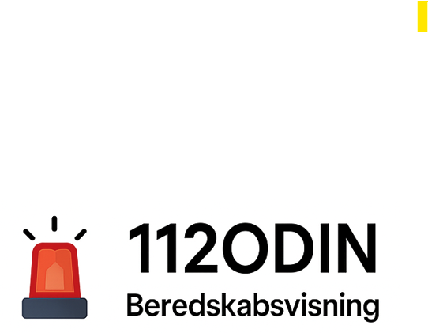

# 🚨 112ODIN Beredskabsvisning

En Home Assistant-integration der viser relevante hændelser fra danske beredskaber baseret på ID, stationer og valgt periode.



## Funktioner

✅ Dynamisk filtrering af hændelser  
✅ UI-konfiguration via Home Assistant  
✅ Kompatibel med HACS  
✅ Tilpas overskrift og visning  
✅ Markdown output klar til dashboard

---

## Installation

**Metode 1: Manuel**

1. Download `112ODIN-beredskabsvisning.zip` fra [Releases](https://github.com/DIT_GITHUBNAVN/homeassistant-beredskabsvisning/releases)
2. Pak ud og placér `custom_components/beredskabsvisning` i din Home Assistant-mappe
3. Genstart Home Assistant
4. Tilføj integration via UI

**Metode 2: HACS**

1. Tilføj repo som _Custom Repository_ i HACS
2. Installer komponenten
3. Genstart og konfigurer via UI

---

## Konfiguration

- Beredskabs ID
- Station(er) (kommasepareret)
- Antal dage (visningsperiode)
- Overskrift (titel på sensor)

---

## Eksempel Markdown output

```text
🚒 Station B assisterer ved færdselsuheld
🔥 Station A slukker brand på industrigrund
⛑️ Station C bistår ved personredning
